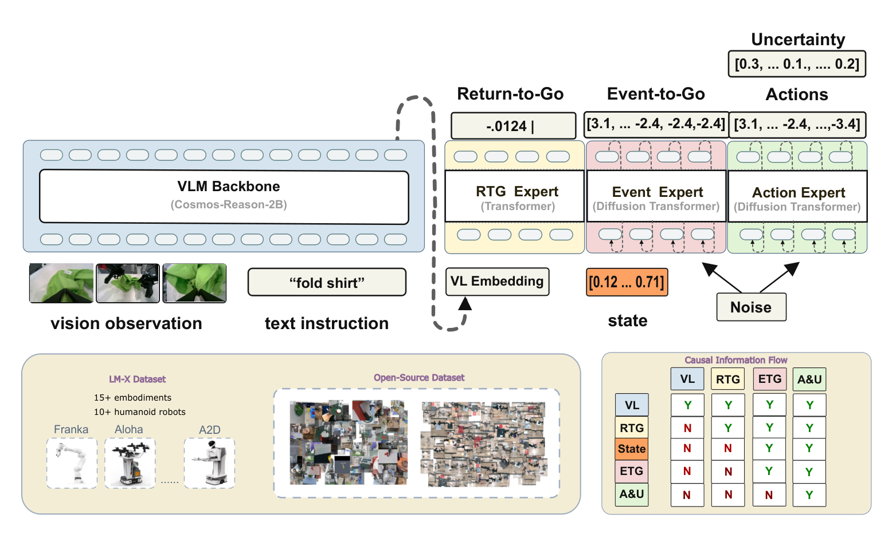
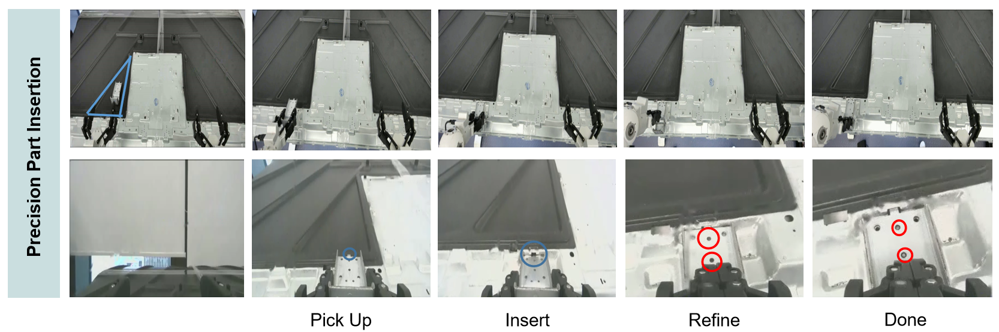
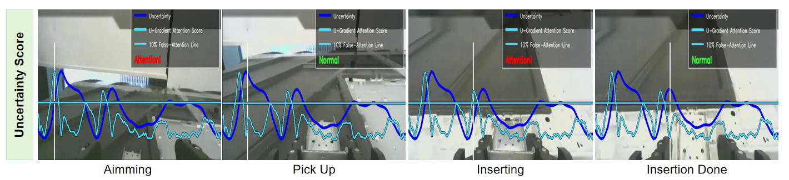

# LoongWu-LM-X-VLA

This repository is the open-source release of **[LM-X: Explainable Vision--Language--Action Modeling via Progress, Event, and Uncertainty Prediction](https://arxiv.org/abs/2608.25757)**.

**English** | [简体中文](README_ZH.md)

[Paper v3](https://arxiv.org/abs/2608.25757v3) · [GitHub](https://github.com/loongOpen/LoongWu-LM-X-VLA) · [AtomGit](https://atomgit.com/openloong/LoongWu-LM-X-VLA) · [Model (HF)](https://huggingface.co/OpenLoong/LoongWu-LM-X-VLA-v1) · [Model (AtomGit)](https://ai.atomgit.com/openloong/LoongWu-LM-X-VLA-v1)

LM-X is a vision–language–action (VLA) model for robot manipulation. It takes multi-view images, language instructions, and robot state as input and produces continuous action chunks. The paper also studies three predictive signals: task progress (RTG), the next semantic event (ETG), and action uncertainty.

This repository provides inference code. Training code and training data are not included. Model downloads and setup instructions are listed below.

## Model overview



*Figure 1: The LM-X architecture described in the paper. Original figure from [LM-X v3, Figure 1](https://arxiv.org/html/2608.25757v3#S1.F1).*

The vision–language backbone is **NVIDIA Cosmos-Reason2-2B (Qwen3-VL architecture)**, which encodes images and task instructions. Robot state is passed directly to the event and action experts.

The three signals in the paper represent:

- **RTG (Return-to-Go):** task progress and state quality at the current observation.
- **ETG (Event-to-Go):** an action chunk leading to the next semantic event, such as grasping, alignment, or insertion.
- **Action uncertainty:** the variance predicted by the action flow, used to analyze local action reliability.

The current code supports action inference, with `value` and `uncertainty` branches enabled according to the checkpoint configuration. **ETG inference code has not been released.** Figure 1 shows the full paper architecture. Differences between the current uncertainty implementation and the paper are documented in the [paper alignment notes](docs/paper_alignment.md) (Chinese).

## Paper results

These results are reported in paper v3. Both evaluations include task-specific adaptation; they are not test results from this repository.

| Evaluation | Mean success rate | Setup |
| --- | --- | --- |
| RoboTwin2.0 | **74.1%** | 50 randomized-hard tasks; 50 adaptation demonstrations and 100 evaluation trials per task |
| Real-world manipulation | **73.5%**¹ | 4 robot embodiments and 7 tasks; 20 trials per task |

Sources: [paper §4.3](https://arxiv.org/html/2608.25757v3#S4.SS3) and [§4.4](https://arxiv.org/html/2608.25757v3#S4.SS4). ¹ The real-world aggregate is retained as reported in the paper. See the [numerical consistency note](docs/paper_alignment.md#论文数值核对) (Chinese) for a recalculation from the table entries.



*Figure 2: Precision part insertion on Astribot S1, from picking up the part to completing the assembly. Original figure from [LM-X v3, Figure 2](https://arxiv.org/html/2608.25757v3#S2.F2).*



*Figure 7: Action uncertainty curves and gradient-based warnings during precision insertion. Original figure from [LM-X v3, Figure 7](https://arxiv.org/html/2608.25757v3#S4.F7); see [paper §4.7](https://arxiv.org/html/2608.25757v3#S4.SS7) for the experiment.*

## Release contents

| Resource | Status |
| --- | --- |
| Inference code | Model loading, image and state preprocessing, action generation, Python API, and ZeroMQ service |
| LM-X v1 checkpoint | [Hugging Face](https://huggingface.co/OpenLoong/LoongWu-LM-X-VLA-v1) / [AtomGit](https://ai.atomgit.com/openloong/LoongWu-LM-X-VLA-v1); specify with `--model-path` |
| Cosmos-Reason2-2B | [NVIDIA official download](https://huggingface.co/nvidia/Cosmos-Reason2-2B); prepare weights, tokenizer, and processor separately and specify with `--backbone-path` |
| Training code and training data | Not included in this release |

## Quick start

### Installation

Use Python **3.12** and [uv](https://docs.astral.sh/uv/):

```bash
git clone https://github.com/loongOpen/LoongWu-LM-X-VLA.git
cd LoongWu-LM-X-VLA
uv sync --frozen --extra server
```

On Linux, the default dependencies use PyTorch 2.9.0 / CUDA 12.8. For other environments, see the [inference guide](docs/inference.md#安装与环境) (Chinese).

### Prepare both model resources

Model inference requires an **LM-X checkpoint** and **`nvidia/Cosmos-Reason2-2B`**. The checkpoint configuration, weights, and normalization statistics must match. The Cosmos directory must also include its tokenizer and processor files. See the [resource requirements](docs/inference.md#checkpoint-资源契约) (Chinese) for supported file layouts and sharded weights.

Download LM-X from either Hugging Face or AtomGit above; only one copy is needed. For Cosmos, use the [NVIDIA model repository](https://huggingface.co/nvidia/Cosmos-Reason2-2B) linked in the [GR00T installation guide](https://github.com/NVIDIA/Isaac-GR00T#installation). Obtain access on the Cosmos model page, then log in with the same Hugging Face account.

Run these commands from the repository root after installation:

```bash
uv run --frozen hf auth login
uv run --frozen hf download OpenLoong/LoongWu-LM-X-VLA-v1 \
  --local-dir ./checkpoints/LoongWu-LM-X-VLA-v1
uv run --frozen hf download nvidia/Cosmos-Reason2-2B \
  --local-dir ./checkpoints/Cosmos-Reason2-2B
```

If using AtomGit for LM-X, download the complete model directory into `./checkpoints/LoongWu-LM-X-VLA-v1` instead of running the first download command.

### Run one inference request

The example below uses the download directories above. Replace `CHECKPOINT_EMBODIMENT_TAG` with a tag supported by your checkpoint; adjust the paths if you saved the models elsewhere.

```bash
uv run --frozen lm-x-smoke \
  --model-path ./checkpoints/LoongWu-LM-X-VLA-v1 \
  --backbone-path ./checkpoints/Cosmos-Reason2-2B \
  --embodiment-tag CHECKPOINT_EMBODIMENT_TAG \
  --device cuda:0 \
  --dtype bfloat16 \
  --local-files-only \
  --seed 0
```

The command uses synthetic observations to check model loading, input/output shapes, and numerical validity. It prints `Smoke inference passed` on success. This step does not measure task success rates.

### Python API

```python
from lm_x import LMXPolicy, make_sample_observation

policy = LMXPolicy(
    model_path="./checkpoints/LoongWu-LM-X-VLA-v1",
    backbone_path="./checkpoints/Cosmos-Reason2-2B",
    embodiment_tag="CHECKPOINT_EMBODIMENT_TAG",
    device="cuda:0",
    local_files_only=True,
)

spec = policy.get_io_spec()
observation = make_sample_observation(spec, instruction="move to the target")
actions, info = policy.get_action(observation)
```

When connecting a robot or evaluation environment, replace the synthetic observations with actual camera images, state, and instructions. Match the fields and sampling times to `spec`.

## Documentation

The following guides are currently in Chinese:

- [Inference guide](docs/inference.md): environment setup, inputs and outputs, server and client, and validation.
- [Model card](docs/model_card.md): model components, resource requirements, and intended use.
- [Paper alignment notes](docs/paper_alignment.md): how the current implementation relates to the paper model.
- [Release notes](docs/release_notes.md).

## License and attribution

The code is released under [Apache-2.0](LICENSE), with copyright and modification notices retained in files derived from NVIDIA's upstream code. Model weight licenses are specified by their respective publishers.

All three images on this page are unmodified original figures from the LM-X v3 paper by Jin Lou et al., reproduced under [CC BY 4.0](https://creativecommons.org/licenses/by/4.0/). Original file URLs and checksums are listed in the [figure attribution file](docs/assets/paper-v3/README.md).

## Citation

If this project helps your research, please cite the [LM-X paper v3](https://arxiv.org/abs/2608.25757v3).

```bibtex
@misc{lou2026lmx,
  title = {LM-X: Explainable Vision--Language--Action Modeling via Progress, Event, and Uncertainty Prediction},
  author = {Jin Lou and Zhiyuan Jing and Xupeng Wang and Andong Chen and Xingdong Zhu and Yuexuan Li and Yuan Xu and Zhijie Zhu and Yingwei Ji and Wenpeng Nie and Renxing Feng and Liangliang Chen and Ying Chu and Jingyi Li and Jinyan Liu and Zhiqi Song and Jingxuan Zhu and Jidong Zhang and Yufei Liu and Boyang Xing and Lei Jiang and Yan Cui and Hongming Li and Yuchen Zhu},
  year = {2026},
  eprint = {2608.25757},
  archivePrefix = {arXiv},
  primaryClass = {cs.RO},
  note = {Version 3, 2026-09-08},
  url = {https://arxiv.org/abs/2608.25757v3}
}
```
