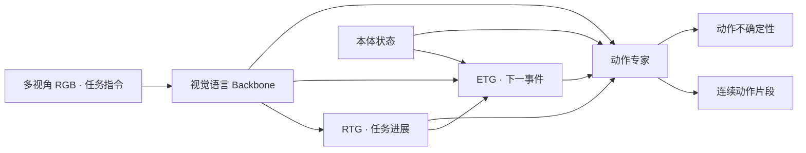

# LoongWu（龙悟LM-X）

**面向机器人操作的可解释视觉—语言—动作模型。**

龙悟LM-X 的研究目标是让机器人在生成动作的同时，呈现对任务进展、下一语义事件与局部动作
可靠性的预测。模型以视觉观察、自然语言指令和本体状态为输入，将可解释的预测信号与动作生成相结合。
模型设计与实验依据为 [LM-X 论文 v3](https://arxiv.org/abs/2608.25757v3)。

本仓库交付独立的 **inference-only 运行时**，提供 checkpoint 加载、观测处理、动作生成和服务化接口。
论文描述完整研究模型；本运行时的实现对应关系、差异和复现状态见[论文对齐说明](docs/paper_alignment.md)。

当前先发布推理代码，模型下载地址将在模型仓库确定后补充。

代码仓库：[GitHub](https://github.com/loongOpen/LoongWu) · [AtomGit](https://atomgit.com/openloong/LoongWu)

[论文 v3](https://arxiv.org/abs/2608.25757v3) · [模型卡](docs/model_card.md) · [推理指南](docs/inference.md) ·
[版本说明](docs/release_notes.md) · [许可证](LICENSE)

## 模型概览

LM-X 使用 NVIDIA Cosmos-Reason2-2B（Qwen3-VL 架构）作为视觉语言基座，编码图像与任务指令，
并通过动作头生成连续动作片段。基座介绍可参考 [GR00T 官方说明](https://github.com/NVIDIA/Isaac-GR00T#whats-new-in-gr00t-n17)。

LM-X 围绕三个控制问题组织可解释信号：

| 控制问题 | 论文中的信号 | 含义 |
| --- | --- | --- |
| 当前任务是否在推进？ | Return-to-Go（RTG） | 估计可见任务进展与状态质量 |
| 下一步要到达什么事件？ | Event-to-Go（ETG） | 预测通向下一语义边界的动作片段 |
| 局部动作有多可靠？ | 动作流不确定性 | 通过异方差预测刻画局部动作可靠性 |

下图概括[论文 §2](https://arxiv.org/html/2608.25757v3#S2)中的条件关系，
不是当前运行时的逐模块执行图：



当前开源运行时暂时不提供 keyframe（ETG）推理相关代码。运行时按 checkpoint
决定 `value` 和 `uncertainty` 分支是否启用，并按本体配置完成动作解码。
上图中的 ETG 仅用于说明论文模型，不代表本仓库包含该分支；详见[模型卡](docs/model_card.md)。

## 论文结果

以下为 **v3 原文报告**，不是本仓库回归测试或 smoke 推理的结果。

| 评测 | 论文报告 | 协议范围 |
| --- | --- | --- |
| RoboTwin2.0 | 74.1% 平均成功率 | 50 个 randomized-hard 任务；每任务 50 条适配示范、100 次测试 |
| 实机操作 | 73.5% 平均成功率¹ | 4 种本体、7 项任务；每任务 20 次测试 |

来源：[论文 §4.3–4.4](https://arxiv.org/html/2608.25757v3#S4.SS3)。两组结果均包含任务适配，
不代表零样本表现或任意 checkpoint 的效果。¹ 实机汇总值与逐项表复算存在差异，
见[数值核对说明](docs/paper_alignment.md#论文数值核对)。

## 发布内容

| 资源 | 当前提供内容 |
| --- | --- |
| 推理代码 | `lm_x` Python 包、模型加载、预处理与动作生成 |
| 部署接口 | `LMXPolicy`、`LMXClient`、`LMXServer`、`lm-x-serve` |
| 验证入口 | `lm-x-smoke`、合成观测示例、CPU 回归测试 |
| LM-X checkpoint | 对应 `--model-path`；下载地址待模型仓库确定后补充 |
| 视觉语言基座 | `nvidia/Cosmos-Reason2-2B`（Qwen3-VL），单独准备，对应 `--backbone-path` |
| 训练代码与数据集 | 不在本次交付范围内 |

本仓库的代码可见性取决于仓库权限；代码、模型权重和训练数据的发布状态分别管理。

## 快速开始

### 1. 安装

使用 Python **3.12** 和 [uv](https://docs.astral.sh/uv/)：

```bash
git clone https://github.com/loongOpen/LoongWu.git
cd LoongWu
uv sync --frozen --extra server
```

Linux 默认使用 PyTorch 2.9.0 / CUDA 12.8 wheel。其他设备需选择匹配的平台依赖；
当前不提供未经目标设备测试的硬件兼容承诺。安装细节见[推理指南](docs/inference.md#安装与环境)。

### 2. 准备模型资源

运行模型推理或真实权重测试需同时准备 **LM-X checkpoint** 和 **Cosmos-Reason2-2B** 两份模型资源，
其中 Cosmos 还需配套 tokenizer 与 processor 文件。以下命令供资源齐备后使用；LM-X checkpoint 目录结构如下：

```text
checkpoint/
├── config.json
├── model.safetensors
├── processor_config.json
├── statistics.json
└── embodiment_id.json
```

也支持 PyTorch bin 权重、索引加完整分片，以及将三个 processor 元数据文件放在
`processor/` 子目录。backbone 可由 `config.json` 的 `model_name` 指定，
或通过 `--backbone-path` 覆盖。详见[资源契约](docs/inference.md#checkpoint-资源契约)。

### 3. 完成首次推理

替换模型路径与 `CHECKPOINT_EMBODIMENT_TAG` 后运行：

```bash
uv run --frozen lm-x-smoke \
  --model-path /absolute/path/to/checkpoint \
  --backbone-path /absolute/path/to/backbone \
  --embodiment-tag CHECKPOINT_EMBODIMENT_TAG \
  --device cuda:0 \
  --dtype bfloat16 \
  --local-files-only \
  --seed 0
```

脚本根据真实 checkpoint 的模态和归一化元数据构造合成观测，执行一次推理，
并检查动作键、batch、时间长度、维度、dtype 与有限值。成功时输出 `Smoke inference passed`；
添加 `--json` 可输出机器可读的结果。合成观测用于验证加载与调用链路，不代表任务效果。

## Python 推理

下面的示例无需自定义占位函数：加载 checkpoint 后，即可生成匹配规格的合成输入并推理。

```python
from lm_x import LMXPolicy, make_sample_observation

policy = LMXPolicy(
    model_path="/absolute/path/to/checkpoint",
    backbone_path="/absolute/path/to/backbone",
    embodiment_tag="CHECKPOINT_EMBODIMENT_TAG",
    device="cuda:0",
    local_files_only=True,
)

spec = policy.get_io_spec()
observation = make_sample_observation(spec, instruction="move to the target")
actions, info = policy.get_action(observation)

for key, value in actions.items():
    print(key, value.shape, value.dtype)
```

接入业务时，将合成输入替换为实际相机、状态和任务指令；按 `spec` 中的键、维度和
`delta_indices` 对齐采样。视频为 RGB `uint8 (B, T, H, W, 3)`，状态为
`float32 (B, T, D)`，输出为 `float32 (B, T_action, D_action)`。

## 服务化推理

在模型机器上启动服务：

```bash
uv run --frozen --extra server lm-x-serve \
  --model-path /absolute/path/to/checkpoint \
  --backbone-path /absolute/path/to/backbone \
  --embodiment-tag CHECKPOINT_EMBODIMENT_TAG \
  --device cuda:0 \
  --local-files-only \
  --host 127.0.0.1 \
  --port 5555
```

客户端使用同一个规格与观测构造函数：

```python
import os

from lm_x import LMXClient, make_sample_observation

with LMXClient(
    host="127.0.0.1",
    port=5555,
    api_token=os.environ.get("LMX_API_TOKEN"),
    timeout_ms=60000,
) as client:
    spec = client.get_io_spec()
    observation = make_sample_observation(spec)
    actions, info = client.get_action(observation)
```

也可直接运行 `uv run --frozen --extra server python scripts/client_inference.py`。
跨主机部署时可用 `LMX_API_TOKEN` 配置共享 token；服务使用同步请求/响应，
token 不提供传输加密。连接、超时与部署说明见[推理指南](docs/inference.md#服务部署)。

## 开发与验证

```bash
uv sync --frozen --all-extras
uv run --frozen ruff check src tests scripts
uv run --frozen ruff format --check src tests scripts
uv build
uv run --frozen pytest -q --timeout=60
uv run --frozen pre-commit run --all-files
```

测试覆盖 checkpoint 清单、完整输入输出规格、优化模式校验、真实 processor 预处理、
动作积分回归、模型加载 mock、ZeroMQ 传输/鉴权/异常恢复和 wheel 内容。
真实 checkpoint 测试通过环境变量显式启用，见[验证说明](docs/inference.md#验证与复现)。

## 许可证与来源

代码采用 [Apache-2.0](LICENSE)。本项目包含基于 NVIDIA 发布的上游源码裁剪和修改的文件，
保留原有版权、许可证与逐文件修改声明。产品及模型名称为“龙悟LM-X”。

checkpoint 与 backbone 的访问、许可、署名和使用条件由其发布方另行提供，
不随本运行时的代码许可证自动授予。模型适用范围与已验证边界见[模型卡](docs/model_card.md)。

## 论文与引用

本文档固定引用 [arXiv:2608.25757v3](https://arxiv.org/abs/2608.25757v3)
（2026-09-08），以便核对叙述与实验口径。2026-09-11 核对时，arXiv 已列出 v4
（2026-09-09）；后续版本见 [arXiv 版本页](https://arxiv.org/abs/2608.25757)。
本仓库的运行时版本与论文版本独立管理。

<details>
<summary>BibTeX</summary>

```bibtex
@misc{lou2026lmx,
  title = {LM-X: Explainable Vision--Language--Action Modeling via Progress, Event, and Uncertainty Prediction},
  author = {Jin Lou and Zhiyuan Jing and Xupeng Wang and Andong Chen and Xingdong Zhu and Yuexuan Li and Yuan Xu and Zhijie Zhu and Yingwei Ji and Wenpeng Nie and Renxing Feng and Liangliang Chen and Ying Chu and Jingyi Li and Jinyan Liu and Zhiqi Song and Jingxuan Zhu and Jidong Zhang and Yufei Liu and Boyang Xing and Lei Jiang and Yan Cui and Hongming Li and Yuchen Zhu},
  year = {2026},
  eprint = {2608.25757},
  archivePrefix = {arXiv},
  primaryClass = {cs.RO},
  note = {Version 3, 2026-09-08},
  url = {https://arxiv.org/abs/2608.25757v3}
}
```

</details>
